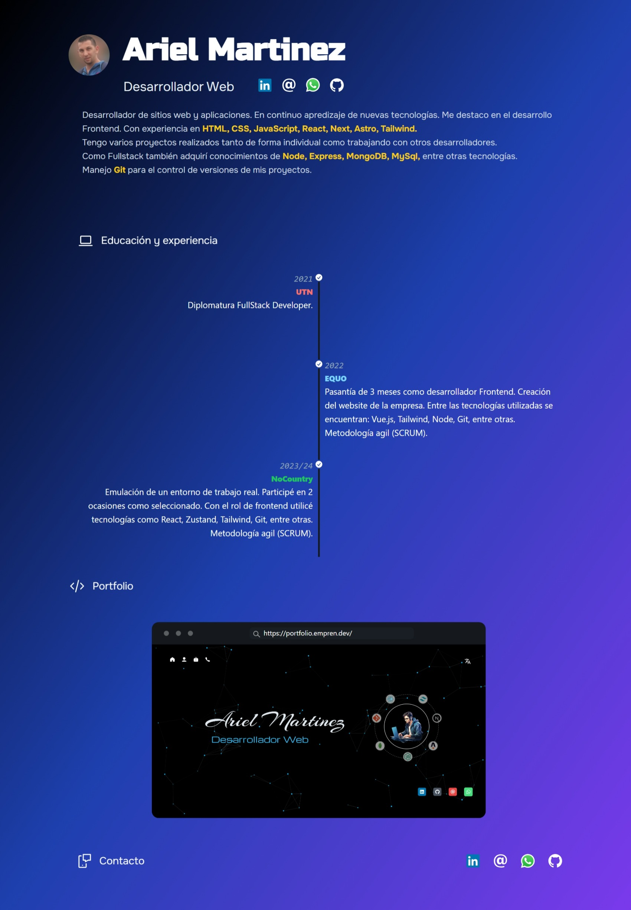

# CV Ariel Martinez



## Descripción

Este proyecto se trata de mi CV personal online realizado con [Astro](https://astro.build/).

## URL del Deploy

[https://cv.empren.dev/](https://cv.empren.dev/)

## Instrucciones para correr el proyecto localmente

1. Clona el repositorio:
    ```sh
    git clone https://github.com/Arielstereo/CV
    ```

2. Navega al directorio del proyecto:
    ```sh
    cd cv
    ```

3. Instala las dependencias:
    ```sh
    npm install
    ```

4. Inicia el servidor de desarrollo:
    ```sh
    npm run dev
    ```

5. Abre tu navegador y visita [http://localhost:4321](http://localhost:4321) para correr el proyecto.